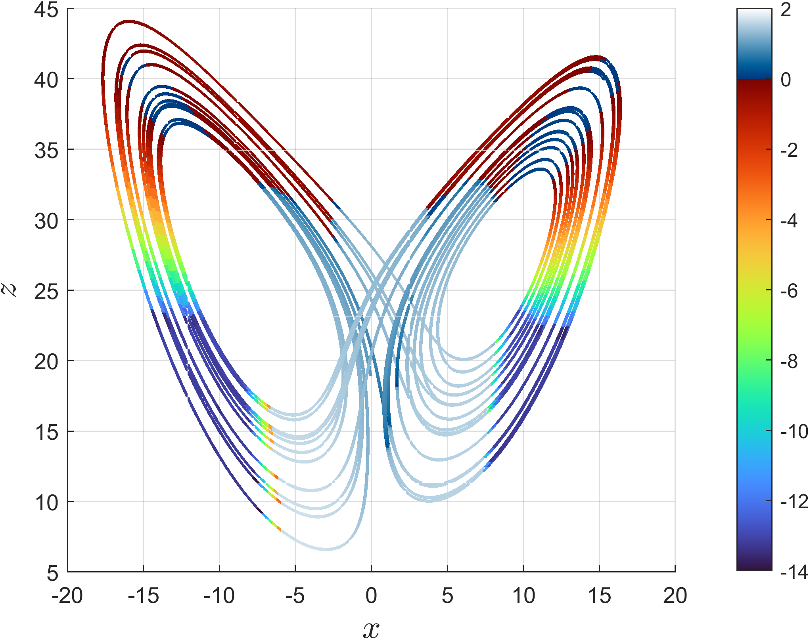

# FastSynchro
Matlab code for fast synchronization demonstration.

This code implements fast synchronization example for Lorenz chaotic oscillators. Color corresponds to relative error synchronization depending on start point of synchronization.

  

When using this code in scientific purposes please refer to the original papaer:
[paper in progress...]
